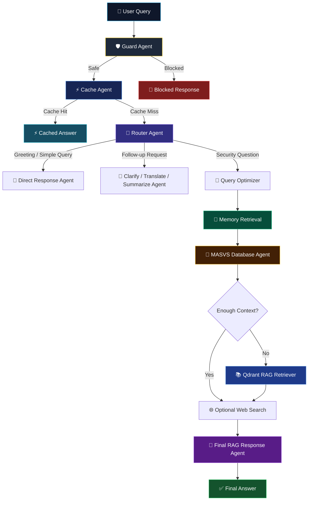
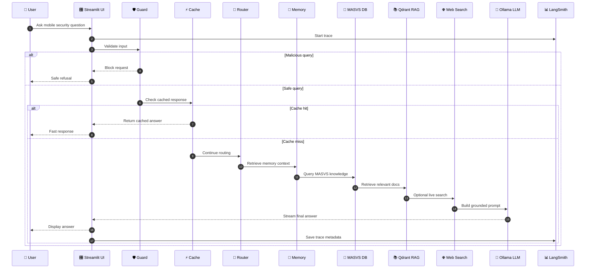
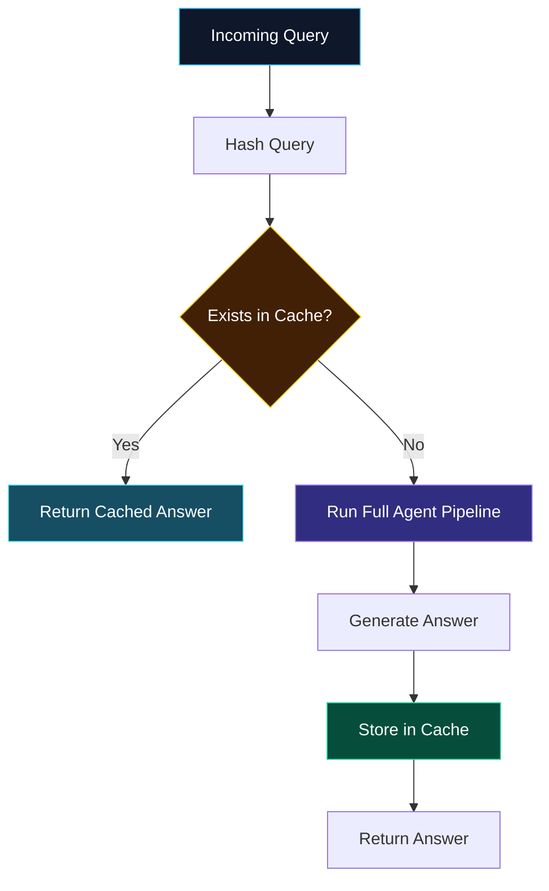
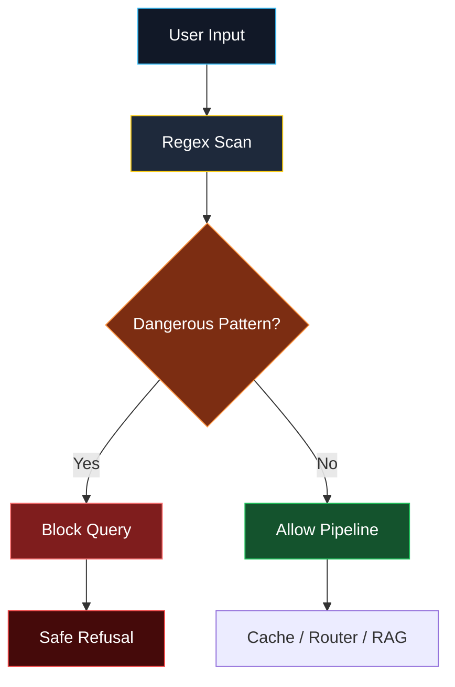
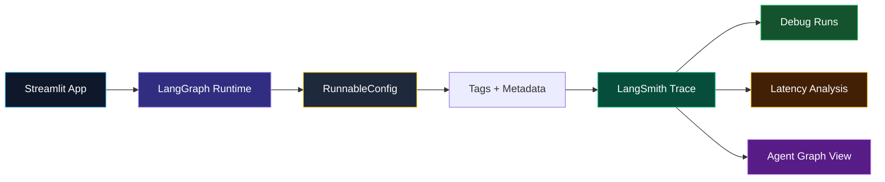

<div align="center">

# 🛡️ LangGraph Multi-Agent Mobile Security Assistant

### Dark Professional AI Security Assistant powered by LangGraph, RAG, FAISS Memory, Cache, Web Search, and LangSmith Observability


<br/>

> A production-style multi-agent AI assistant for mobile application security, MASVS reasoning, secure storage guidance, network security, authentication, and safe testing workflows.

</div>

---

## ✨ Overview

**LangGraph Multi-Agent Mobile Security Assistant** is an advanced agentic AI system designed for mobile security Q&A.

It combines:

- 🧠 **Advanced long-term memory**
- 📚 **Retrieval-Augmented Generation**
- ⚡ **Cache-Augmented Generation**
- 🛡️ **Prompt-injection and malicious query guard**
- 🌐 **Optional web search**
- 📊 **LangSmith tracing**
- 🎛️ **Professional Streamlit dashboard**
- 🌍 **Arabic + English support**

---

## 🧠 Core Idea

Instead of using a single chatbot pipeline, this project uses a real **multi-agent architecture**.

Each user query passes through specialized agents:



---

## 🔄 End-to-End Execution Flow



---

## 🧩 System Components

| Component | Role |
|---|---|
| 🛡️ **Guard Agent** | Detects malicious or unsafe queries before they reach the LLM |
| ⚡ **Cache Agent** | Returns repeated answers instantly without rerunning the full pipeline |
| 🧭 **Router Agent** | Routes each query to direct, follow-up, or RAG workflow |
| 🔎 **Query Optimizer** | Prepares search-ready queries for retrieval |
| 🧠 **Enhanced Memory Agent** | Stores and retrieves long-term semantic memory with FAISS |
| 📘 **Database Agent** | Looks up MASVS security requirements |
| 📚 **Retriever Agent** | Uses Qdrant for document-based RAG |
| 🌐 **Web Search Tool** | Uses Tavily or DuckDuckGo fallback for live information |
| 🤖 **Response Agent** | Generates final grounded answers |
| 📊 **LangSmith** | Provides tracing, debugging, and observability |

---

## 🧠 Advanced Memory Architecture

The memory module is not simple chat history.

It supports:

- Semantic embeddings
- FAISS vector indexing
- Similarity retrieval
- Importance scoring
- Recency-aware ranking
- Access-count tracking
- Long-term memory compression


---

## ⚡ Cache-Aware Generation

Repeated queries are served instantly using a cache layer.



---

## 🛡️ Security Guard Flow



---

## 📊 Observability with LangSmith

LangSmith tracing is supported for debugging every graph execution.

You can inspect:

- Agent execution order
- Routing decisions
- Cache hits
- LLM latency
- Prompt inputs
- Final outputs
- Runtime metadata



---

## 🎛️ Streamlit Dashboard

The interface includes:

- 💬 Security chat
- ⚙️ System settings
- 🧠 Memory and RAG dashboard
- 📊 Agent logs
- 🔍 Last execution trace
- 📥 Export chat as JSON
- 🌐 Web search toggle
- ⚡ Cache toggle
- 📊 LangSmith toggle

---

## 🧪 Example Questions

```text
What does MASVS say about secure storage?
```

```text
Explain mobile network security, TLS, and certificate pinning.
```

```text
My app stores JWT tokens locally. Remember this context.
```

```text
What should I improve in my app?
```

```text
اشرح secure storage في تطبيقات الموبايل
```

```text
Translate the previous answer to English.
```

---

## 📁 Project Structure

```bash
.
├── app.py                         # Streamlit dashboard
├── agents.py                      # Guard, database, retriever, routing logic
├── langgraph_workflow.py          # LangGraph orchestration
├── memory_enhanced.py             # Advanced FAISS memory
├── tools.py                       # Web search and cache tools
├── config.py                      # Environment-based config
├── masvs.json                     # MASVS knowledge base
├── requirements.txt               # Dependencies
├── .env.example                   # Environment template
└── README.md
```

---

## ⚙️ Installation

### 1. Clone the repository

```bash
git clone https://github.com/A7med668/LangGraph-Multi-Agent-Mobile-Security-Assistant.git
cd LangGraph-Multi-Agent-Mobile-Security-Assistant
```

### 2. Create virtual environment

```bash
python -m venv llm_env
```

### 3. Activate environment

#### Windows

```bash
llm_env\Scripts\activate
```

#### macOS / Linux

```bash
source llm_env/bin/activate
```

### 4. Install dependencies

```bash
pip install -r requirements.txt
```

---

## 🦙 Ollama Setup

Start Ollama:

```bash
ollama serve
```

Pull required models:

```bash
ollama pull mistral:latest
ollama pull llama3:latest
ollama pull nomic-embed-text:latest
```

---

## 🔐 Environment Setup

Copy the environment template:

```bash
copy .env.example .env
```

On macOS / Linux:

```bash
cp .env.example .env
```

Edit `.env`:

```env
RESPONSE_MODEL=mistral:latest
GUARD_MODEL=llama3:latest
EMBEDDINGS_MODEL=nomic-embed-text:latest
MEMORY_EMBEDDINGS_MODEL=paraphrase-multilingual-MiniLM-L12-v2

DATA_FOLDER=./owasp_rag_data
QDRANT_PATH=./qdrant_local
QDRANT_COLLECTION=security_assistant
MASVS_FILE=./masvs.json
MEMORY_INDEX_PATH=./faiss_memory_enhanced

ENABLE_CACHE=true
ENABLE_WEB_SEARCH=false

ENABLE_LANGSMITH=false
LANGSMITH_API_KEY=
LANGSMITH_PROJECT=mobile-security-assistant

TAVILY_API_KEY=
```

---

## ▶️ Run the App

```bash
streamlit run app.py
```

Then open:

```text
http://localhost:8501
```

---

## 🌐 Optional Web Search

To enable live web search:

```env
ENABLE_WEB_SEARCH=true
TAVILY_API_KEY=your_tavily_key
```

If no Tavily key is configured, the system can fall back to DuckDuckGo when available.

---

## 📊 Optional LangSmith Tracing

To enable LangSmith:

```env
ENABLE_LANGSMITH=true
LANGSMITH_TRACING=true
LANGSMITH_API_KEY=your_langsmith_key
LANGSMITH_PROJECT=mobile-security-assistant

LANGCHAIN_TRACING_V2=true
LANGCHAIN_API_KEY=your_langsmith_key
LANGCHAIN_PROJECT=mobile-security-assistant
```

Then restart Streamlit.

---

## 🧪 Testing Checklist

| Test | Expected Result |
|---|---|
| Ask `hello` | Direct response |
| Ask same query twice | Cache hit |
| Ask MASVS secure storage question | Database / RAG response |
| Ask Arabic question | Arabic response |
| Ask follow-up translation | Uses previous answer |
| Ask unsafe hacking query | Guard blocks it |
| Enable LangSmith | Trace appears in LangSmith dashboard |

---

## 🏆 Project Grading Alignment

| Requirement | Implementation |
|---|---|
| Multi-Agent System | LangGraph agents with conditional routing |
| Advanced Memory | FAISS semantic memory with scoring and compression |
| Tool Integration | RAG, CAG, MASVS DB, optional web search |
| User Interface | Streamlit dashboard |
| Bonus: Multilingual | Arabic + English |
| Bonus: Prompt Injection Detection | Guard Agent |
| Bonus: Observability | LangSmith tracing |

---

## 🚀 Tech Stack

| Layer | Technology |
|---|---|
| UI | Streamlit |
| Orchestration | LangGraph |
| LLM Runtime | Ollama |
| LLM Interface | LangChain |
| Vector Database | Qdrant |
| Memory Index | FAISS |
| Embeddings | SentenceTransformers + Ollama Embeddings |
| Web Search | Tavily / DuckDuckGo |
| Observability | LangSmith |
| Language | Python |

---

## 🔮 Future Improvements

- Docker deployment
- Authentication system
- Evaluation dashboard
- Per-agent latency analytics
- More MASVS datasets
- PDF upload from UI
- Multimodal mobile app screenshot analysis
- Agent decision explanations

---

## 👨‍💻 Author

**Ahmed Hussein**  
Faculty of Artificial Intelligence

---

## 📄 License

Academic Use Only

---

<div align="center">

### ⭐ If you like this project, give it a star.

**Built with LangGraph, Streamlit, FAISS, Qdrant, Ollama, and LangSmith.**

</div>