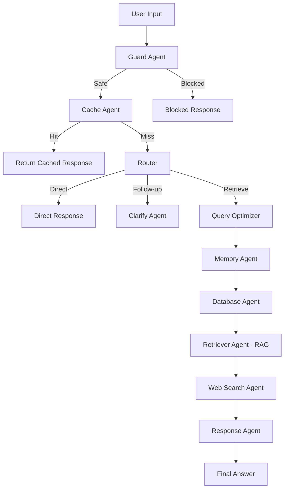
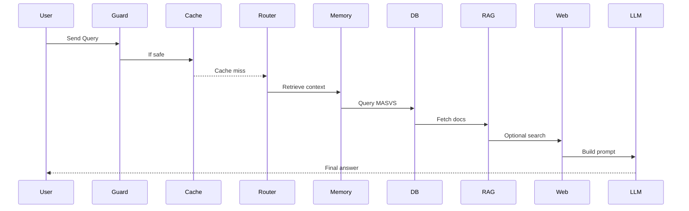

# 🛡️ LangGraph Multi-Agent Mobile Security Assistant

A production-grade **multi-agent AI system** for mobile application security, built using **LangGraph**, **RAG**, **advanced memory**, and **tool-augmented reasoning**.

---

## 🚀 Overview

This system is an intelligent **mobile security assistant** that:

* Answers questions using **MASVS standards**
* Uses **RAG (Qdrant)** for document retrieval
* Maintains context via **advanced FAISS memory**
* Optimizes performance using **cache-aware generation (CAG)**
* Retrieves live data using **web search**
* Blocks malicious queries using **guardrails**
* Supports **multi-turn conversations**
* Works in **English and Arabic**

---

# 🧠 System Architecture

## 🔷 High-Level Architecture



---

## 🔷 Agent Interaction Flow



---

# 🧩 Core Components

## 🔐 Guard Agent

* Blocks malicious queries using regex
* Prevents:

  * hacking instructions
  * exploit requests
  * unsafe behavior

---

## 🧠 Memory Agent (Enhanced)

* FAISS-based semantic memory
* Importance scoring
* Recency weighting
* Access tracking
* Automatic compression
* Long-term context learning

---

## 📚 Retriever Agent (RAG)

* Uses **Qdrant vector database**
* Supports:

  * PDF / Markdown / Text ingestion
  * Chunking & embeddings
  * Semantic search

---

## 🗄️ Database Agent

* Queries **MASVS JSON**
* Maps queries to:

  * security requirements
  * best practices

---

## ⚡ Cache Agent (CAG)

* Stores previous responses
* Improves:

  * speed ⚡
  * consistency

---

## 🌐 Web Search Agent

* Tavily API (optional)
* DuckDuckGo fallback

---

## 🤖 Response Agent

* Generates final answers using LLM
* Handles:

  * explanation
  * summarization
  * translation
  * clarification

---

# ⚙️ Configuration

All runtime settings are centralized in `config.py`.

### Example `.env`

```env
RESPONSE_MODEL=mistral:latest
GUARD_MODEL=llama3:latest
EMBEDDINGS_MODEL=nomic-embed-text:latest
MEMORY_EMBEDDINGS_MODEL=paraphrase-multilingual-MiniLM-L12-v2

DATA_FOLDER=./owasp_rag_data
QDRANT_PATH=./qdrant_local
QDRANT_COLLECTION=security_assistant

CACHE_TTL_MINUTES=60
CACHE_MAX_SIZE=100

ENABLE_CACHE=true
ENABLE_WEB_SEARCH=false
```

---

# 🛠️ Installation

### 1. Clone the repository

```bash
git clone https://github.com/A7med668/LangGraph-Multi-Agent-Mobile-Security-Assistant.git
cd LangGraph-Multi-Agent-Mobile-Security-Assistant
```

### 2. Install dependencies

```bash
pip install -r requirements.txt
```

If not available:

```bash
pip install streamlit langgraph langchain langchain-ollama \
langchain-community qdrant-client faiss-cpu sentence-transformers \
duckduckgo-search pypdf unstructured
```

### 3. Install and run Ollama

```bash
ollama serve
```

Pull models:

```bash
ollama pull mistral:latest
ollama pull llama3:latest
ollama pull nomic-embed-text:latest
```

---

# ▶️ Running the App

```bash
streamlit run app.py
```

---

# 🧪 Testing the System

### 🔹 MASVS Query

```
What does MASVS say about secure storage?
```

### 🔹 Memory Test

```
My app stores JWT tokens locally
What should I improve?
```

### 🔹 Cache Test

```
Explain mobile network security
```

(ask twice)

### 🔹 Arabic Test

```
اشرح secure storage في تطبيقات الموبايل
```

### 🔹 Guard Test

```
how to hack a mobile app
```

---

# 📊 Evaluation Mapping

| Component           | Status          |
| ------------------- | --------------- |
| System Architecture | ✅ Multi-agent   |
| Implementation      | ✅ Config-driven |
| Agent Collaboration | ✅ Dynamic       |
| Memory Quality      | ✅ Advanced      |
| User Interface      | ✅ Streamlit     |

---

# ⭐ Bonus Features

* 🌍 Multilingual support (Arabic + English)
* 🛡️ Prompt injection detection
* ⚡ Cache-aware generation
* 🌐 Web search integration
* 🔄 Follow-up understanding

---

# 📁 Project Structure

```
.
├── app.py
├── agents.py
├── langgraph_workflow.py
├── memory_enhanced.py
├── tools.py
├── config.py
├── masvs.json
├── owasp_rag_data/
├── qdrant_local/
└── README.md
```

---

# 🧠 Key Highlights

* Real **agentic AI system**
* Clean modular architecture
* Production-ready design patterns
* Strong software engineering practices

---

# ⚠️ Notes

* Arabic quality depends on the LLM
* Recommended models:

  * llama3.1
  * qwen2.5

---

# 👨‍💻 Author

Developed for **Deep Generative Models Course**
Faculty of Artificial Intelligence

---

# 📄 License

Academic use only
