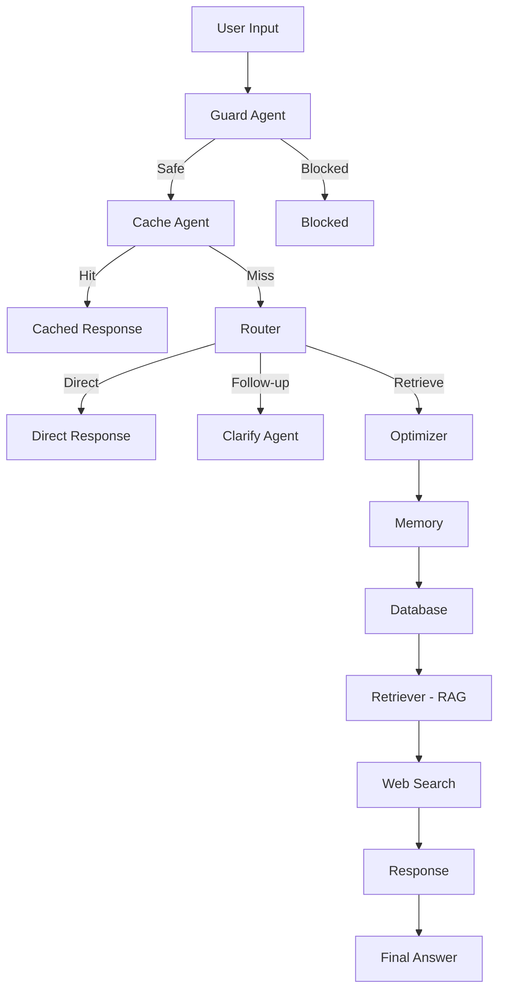
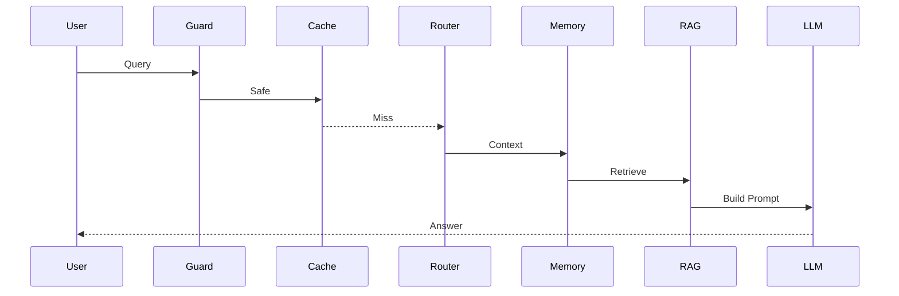

# 🛡️ LangGraph Multi-Agent Mobile Security Assistant

<p align="center">
  
  
  
  
</p>

<p align="center">
  <b>⚡ Production-Grade Multi-Agent AI System for Mobile Security</b>
</p>

---

## 🌑 Overview

> Intelligent AI assistant for mobile application security powered by **LangGraph orchestration**, **RAG**, and **adaptive memory systems**.

### 🚀 Capabilities

* 🔐 MASVS-based security reasoning
* 🧠 Context-aware conversations (long-term memory)
* 📚 Document retrieval using RAG (Qdrant)
* ⚡ Cache-aware generation (CAG)
* 🌐 Real-time web search
* 🛡️ Prompt injection & malicious query detection
* 🌍 Multilingual support (English + Arabic)

---

# 🧠 Architecture

## ⚙️ System Pipeline



---

## 🔄 Agent Flow



---

# 🧩 Core Modules

## 🔐 Guard Agent

* Blocks malicious inputs (regex-based)
* Prevents hacking / exploit instructions

## 🧠 Memory Agent

* FAISS semantic memory
* Importance + recency scoring
* Auto compression
* Long-term learning

## 📚 RAG (Retriever)

* Qdrant vector DB
* Semantic document search
* PDF / Markdown ingestion

## ⚡ Cache Agent

* Instant responses for repeated queries
* Smart skip for follow-ups

## 🌐 Web Search

* Tavily API (optional)
* DuckDuckGo fallback

## 🤖 Response Agent

* Context-aware generation
* Handles explain / summarize / translate

---

# ⚙️ Configuration

```env
RESPONSE_MODEL=mistral:latest
GUARD_MODEL=llama3:latest
EMBEDDINGS_MODEL=nomic-embed-text:latest

DATA_FOLDER=./owasp_rag_data
QDRANT_PATH=./qdrant_local

ENABLE_CACHE=true
ENABLE_WEB_SEARCH=false
```

---

# 🛠️ Setup

```bash
git clone https://github.com/A7med668/LangGraph-Multi-Agent-Mobile-Security-Assistant.git
cd LangGraph-Multi-Agent-Mobile-Security-Assistant

pip install -r requirements.txt

ollama serve
ollama pull mistral:latest
ollama pull llama3:latest

streamlit run app.py
```

---

# 🧪 Example Usage

```text
User: My app stores JWT tokens locally
→ Memory stores context

User: What should I improve?
→ Context-aware response generated
```

---

# 📊 Evaluation

| Component      | Status          |
| -------------- | --------------- |
| Architecture   | 🟢 Multi-Agent  |
| Implementation | 🟢 Configurable |
| Collaboration  | 🟢 Dynamic      |
| Memory         | 🟢 Advanced     |
| UI             | 🟢 Interactive  |

---

# ⭐ Features

* 🧠 Advanced memory system
* ⚡ RAG + CAG hybrid pipeline
* 🛡️ Security guardrails
* 🌍 Multilingual AI
* 📊 Agent trace visualization

---

# 📁 Structure

```bash
.
├── app.py
├── agents.py
├── langgraph_workflow.py
├── memory_enhanced.py
├── tools.py
├── config.py
├── masvs.json
└── README.md
```

---

# ⚠️ Notes

* Arabic output depends on LLM quality
* Recommended models:

  * `llama3.1`
  * `qwen2.5`

---

# 👨‍💻 Author

**Ahmed Hussein**
Faculty of Artificial Intelligence

---

# 📄 License

Academic Use Only
